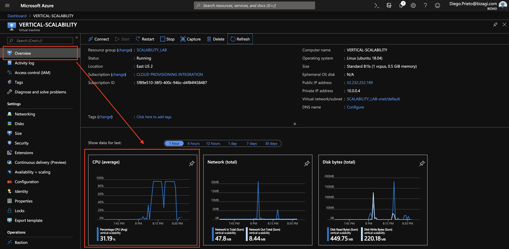

### Escuela Colombiana de Ingeniería
### Arquitecturas de Software - ARSW

## Integrantes
*  Juan Sebastian Gomez
*  Andres Guillermo Rocha


## Escalamiento en Azure con Maquinas Virtuales, Sacale Sets y Service Plans

### Dependencias
* Cree una cuenta gratuita dentro de Azure. Para hacerlo puede guiarse de esta [documentación](https://azure.microsoft.com/en-us/free/search/?&ef_id=Cj0KCQiA2ITuBRDkARIsAMK9Q7MuvuTqIfK15LWfaM7bLL_QsBbC5XhJJezUbcfx-qAnfPjH568chTMaAkAsEALw_wcB:G:s&OCID=AID2000068_SEM_alOkB9ZE&MarinID=alOkB9ZE_368060503322_%2Bazure_b_c__79187603991_kwd-23159435208&lnkd=Google_Azure_Brand&dclid=CjgKEAiA2ITuBRDchty8lqPlzS4SJAC3x4k1mAxU7XNhWdOSESfffUnMNjLWcAIuikQnj3C4U8xRG_D_BwE). Al hacerlo usted contará con $200 USD para gastar durante 1 mes.

### Parte 0 - Entendiendo el escenario de calidad

Adjunto a este laboratorio usted podrá encontrar una aplicación totalmente desarrollada que tiene como objetivo calcular el enésimo valor de la secuencia de Fibonnaci.

**Escalabilidad**
Cuando un conjunto de usuarios consulta un enésimo número (superior a 1000000) de la secuencia de Fibonacci de forma concurrente y el sistema se encuentra bajo condiciones normales de operación, todas las peticiones deben ser respondidas y el consumo de CPU del sistema no puede superar el 70%.

### Parte 1 - Escalabilidad vertical

1. Diríjase a el [Portal de Azure](https://portal.azure.com/) y a continuación cree una maquina virtual con las características básicas descritas en la imágen 1 y que corresponden a las siguientes:
    * Resource Group = SCALABILITY_LAB
    * Virtual machine name = VERTICAL-SCALABILITY
    * Image = Ubuntu Server 
    * Size = Standard B1ls
    * Username = scalability_lab
    * SSH publi key = Su llave ssh publica


2. Para conectarse a la VM use el siguiente comando, donde las `x` las debe remplazar por la IP de su propia VM.

    `ssh scalability_lab@xxx.xxx.xxx.xxx`

3. Instale node, para ello siga la sección *Installing Node.js and npm using NVM* que encontrará en este [enlace](https://linuxize.com/post/how-to-install-node-js-on-ubuntu-18.04/).
4. Para instalar la aplicación adjunta al Laboratorio, suba la carpeta `FibonacciApp` a un repositorio al cual tenga acceso y ejecute estos comandos dentro de la VM:

    `git clone <your_repo>`

    `cd <your_repo>/FibonacciApp`

    `npm install`

5. Para ejecutar la aplicación puede usar el comando `npm FibinacciApp.js`, sin embargo una vez pierda la conexión ssh la aplicación dejará de funcionar. Para evitar ese compartamiento usaremos *forever*. Ejecute los siguientes comando dentro de la VM.

    `npm install forever -g`

    `forever start FibinacciApp.js`

6. Antes de verificar si el endpoint funciona, en Azure vaya a la sección de *Networking* y cree una *Inbound port rule* tal como se muestra en la imágen. Para verificar que la aplicación funciona, use un browser y user el endpoint `http://xxx.xxx.xxx.xxx:3000/fibonacci/6`. La respuesta debe ser `The answer is 8`.


7. La función que calcula en enésimo número de la secuencia de Fibonacci está muy mal construido y consume bastante CPU para obtener la respuesta. Usando la consola del Browser documente los tiempos de respuesta para dicho endpoint usando los siguintes valores:
    * 1000000
    * 1010000
    * 1020000
    * 1030000
    * 1040000
    * 1050000
    * 1060000
    * 1070000
    * 1080000
    * 1090000    

8. Dírijase ahora a Azure y verifique el consumo de CPU para la VM. (Los resultados pueden tardar 5 minutos en aparecer).



9. Ahora usaremos Postman para simular una carga concurrente a nuestro sistema. Siga estos pasos.
    * Instale newman con el comando `npm install newman -g`. Para conocer más de Newman consulte el siguiente [enlace](https://learning.getpostman.com/docs/postman/collection-runs/command-line-integration-with-newman/).
    * Diríjase hasta la ruta `FibonacciApp/postman` en una maquina diferente a la VM.
    * Para el archivo `[ARSW_LOAD-BALANCING_AZURE].postman_environment.json` cambie el valor del parámetro `VM1` para que coincida con la IP de su VM.
    * Ejecute el siguiente comando.

    ```
    newman run ARSW_LOAD-BALANCING_AZURE.postman_collection.json -e [ARSW_LOAD-BALANCING_AZURE].postman_environment.json -n 10 &
    newman run ARSW_LOAD-BALANCING_AZURE.postman_collection.json -e [ARSW_LOAD-BALANCING_AZURE].postman_environment.json -n 10
    ```

10. La cantidad de CPU consumida es bastante grande y un conjunto considerable de peticiones concurrentes pueden hacer fallar nuestro servicio. Para solucionarlo usaremos una estrategia de Escalamiento Vertical. En Azure diríjase a la sección *size* y a continuación seleccione el tamaño `B2ms`.


11. Una vez el cambio se vea reflejado, repita el paso 7, 8 y 9.
12. Evalue el escenario de calidad asociado al requerimiento no funcional de escalabilidad y concluya si usando este modelo de escalabilidad logramos cumplirlo.
13. Vuelva a dejar la VM en el tamaño inicial para evitar cobros adicionales.

**Preguntas**

1. ¿Cuántos y cuáles recursos crea Azure junto con la VM?
  * Cuenta de almacenamiento
  * Direccion IP publica
  * Disco
  * Grupo de seguridad de red
  * Interfaz de red
  * Red virtual
2. ¿Brevemente describa para qué sirve cada recurso?
  * Cuenta de almacenamiento: Es una cuenta que contiene los servicios de Azure Storage, la cual permite acceder a ellos via http o https.
  * Direccion IP publica: es la direccion por la cual se puede conectar a la maquina virtual.
  * Disco: es el disco que tiene actualmente la maquina y que se le permite hacer escalabilidad.
  * Grupo de seguridad de red: Restringe el trafico de y hacia algunos recursos dependiendo de unas politicas de seguridad que tiene azure.
  * Interfaz de red: le permite a la maquina cominucarse con recursos de internet, recursos de Azure o locales.
  * Red virtual: permite en los recursos la comunicacion segura entre usuarios, internet o con redes locales. Permite ventajas en escalabilidad y disponibilidad.
3. ¿Al cerrar la conexión ssh con la VM, por qué se cae la aplicación que ejecutamos con el comando `npm FibonacciApp.js`? ¿Por qué debemos crear un *Inbound port rule* antes de acceder al servicio?
  * Cuando se cierra la conexion ssh se cierran todos los procesos que esten corriendo, el comando forver se eencarga de mantener el proceso en ejecucion.
  * El *Inbound port rule* permite a la maquina comnpartir informacion por el puerto que se le indique y el puerto 3000 era el que tenia el script por defecto
4. Adjunte tabla de tiempos e interprete por qué la función tarda tanto tiempo.

### Inicial

| Request | Tiempo |
|---------|--------|
| 1000000 | 23.41s |
| 1010000 | 23.28s |
| 1020000 | 25.12s |
| 1030000 | 28.02s |
| 1040000 | 27.73s |
| 1050000 | 34.09s |
| 1060000 | 38.54s |
| 1070000 | 29.92s |
| 1080000 | 33.86s |
| 1090000 | 29.63s |


### Final

| Request | Tiempo |
|---------|--------|
| 1000000 | 20.51s |
| 1010000 | 21.99s |
| 1020000 | 21.13s |
| 1030000 | 22.07s |
| 1040000 | 21.49s |
| 1050000 | 23.64s |
| 1060000 | 23.29s |
| 1070000 | 22.43s |
| 1080000 | 23.61s |
| 1090000 | 24.18s |

La respuesta toma este timepo debido a que la funcion que calcula el resultado tien un tiempo lineal O(n) siempre debido a que no se esta manejando ningun sistema de memorizacion por lo tanto siempre calcula la funcion desde 0. 

5. Adjunte imágen del consumo de CPU de la VM e interprete por qué la función consume esa cantidad de CPU.

### Inicial


### Final


6. Adjunte la imagen del resumen de la ejecución de Postman. Interprete:

### Inicial


### Final


    * Tiempos de ejecución de cada petición.

Se puede apreciar aque al hacer el escalamiento vertical el servidor fue capaz de resolver las peticiones casi un segundo mas rapido en promedio.

    * Si hubo fallos documentelos y explique.

7. ¿Cuál es la diferencia entre los tamaños `B2ms` y `B1ls` (no solo busque especificaciones de infraestructura)?

Estos tamaños hacen parte de la serie B, una serie de maquinas virtuales de bajo costo para alojar bases de datos pequeñas o servicios web de baja demanda.

|  Categ  |  B2MS  |  B1LS  |
|---------|--------|--------|
|  vCPU   |    2   |    1   | 
|   RAM   |   8Gb  |  0.5Gb |
|   Temp Storage   | 16Bg | 4Gb |


8. ¿Aumentar el tamaño de la VM es una buena solución en este escenario?, ¿Qué pasa con la FibonacciApp cuando cambiamos el tamaño de la VM?
  * Para este escenario no se considera una buena solucion un escalamiento verticar ya que al aumentar los recursos de la maquina esta puede procesar informacion mucho mas rapido pero la mejoria en tiempos no se ve muy rentable comparada con el costo
  * FibonacciApp puede dar respuesta mas rapido ya que la funcion de FibonacciService procesa datos mas rapido.
9. ¿Qué pasa con la infraestructura cuando cambia el tamaño de la VM? ¿Qué efectos negativos implica?

Al realizar un cambio en el hardware de la maquina esta genera que la maquina tenga que apagarse para realizar el cambio de tamaño. Al tener que apagarse el servicio queda deshabilitado por el tiempo que demore la el cambio, generando una falla de disponibilidad.

10. ¿Hubo mejora en el consumo de CPU o en los tiempos de respuesta? Si/No ¿Por qué?
  * En ambos hubo mejoría, en la parte inicial veiamos que la cpu llegaba a un 83% cuando se ralizaban peticiones muy grandes mientras que en la parte final llegaba a un maximo de 47%, en cuanto a los tiempos no se vio una mejoria muy grande, de 1 segundo en promedio.
11. Aumente la cantidad de ejecuciones paralelas del comando de postman a `4`. ¿El comportamiento del sistema es porcentualmente mejor?


### Parte 2 - Escalabilidad horizontal

#### Crear el Balanceador de Carga

Antes de continuar puede eliminar el grupo de recursos anterior para evitar gastos adicionales y realizar la actividad en un grupo de recursos totalmente limpio.

1. El Balanceador de Carga es un recurso fundamental para habilitar la escalabilidad horizontal de nuestro sistema, por eso en este paso cree un balanceador de carga dentro de Azure tal cual como se muestra en la imágen adjunta.


2. A continuación cree un *Backend Pool*, guiese con la siguiente imágen.


3. A continuación cree un *Health Probe*, guiese con la siguiente imágen.


4. A continuación cree un *Load Balancing Rule*, guiese con la siguiente imágen.


5. Cree una *Virtual Network* dentro del grupo de recursos, guiese con la siguiente imágen.


#### Crear las maquinas virtuales (Nodos)

Ahora vamos a crear 3 VMs (VM1, VM2 y VM3) con direcciones IP públicas standar en 3 diferentes zonas de disponibilidad. Después las agregaremos al balanceador de carga.

1. En la configuración básica de la VM guíese por la siguiente imágen. Es importante que se fije en la "Avaiability Zone", donde la VM1 será 1, la VM2 será 2 y la VM3 será 3.


2. En la configuración de networking, verifique que se ha seleccionado la *Virtual Network*  y la *Subnet* creadas anteriormente. Adicionalmente asigne una IP pública y no olvide habilitar la redundancia de zona.


3. Para el Network Security Group seleccione "avanzado" y realice la siguiente configuración. No olvide crear un *Inbound Rule*, en el cual habilite el tráfico por el puerto 3000. Cuando cree la VM2 y la VM3, no necesita volver a crear el *Network Security Group*, sino que puede seleccionar el anteriormente creado.


4. Ahora asignaremos esta VM a nuestro balanceador de carga, para ello siga la configuración de la siguiente imágen.


5. Finalmente debemos instalar la aplicación de Fibonacci en la VM. para ello puede ejecutar el conjunto de los siguientes comandos, cambiando el nombre de la VM por el correcto

```
git clone https://github.com/daprieto1/ARSW_LOAD-BALANCING_AZURE.git

curl -o- https://raw.githubusercontent.com/creationix/nvm/v0.34.0/install.sh | bash
source /home/vm1/.bashrc
nvm install node

cd ARSW_LOAD-BALANCING_AZURE/FibonacciApp
npm install

npm install forever -g
forever start FibonacciApp.js
```

Realice este proceso para las 3 VMs, por ahora lo haremos a mano una por una, sin embargo es importante que usted sepa que existen herramientas para aumatizar este proceso, entre ellas encontramos Azure Resource Manager, OsDisk Images, Terraform con Vagrant y Paker, Puppet, Ansible entre otras.

#### Probar el resultado final de nuestra infraestructura

1. Porsupuesto el endpoint de acceso a nuestro sistema será la IP pública del balanceador de carga, primero verifiquemos que los servicios básicos están funcionando, consuma los siguientes recursos:

```
http://52.155.223.248/
http://52.155.223.248/fibonacci/1
```

2. Realice las pruebas de carga con `newman` que se realizaron en la parte 1 y haga un informe comparativo donde contraste: tiempos de respuesta, cantidad de peticiones respondidas con éxito, costos de las 2 infraestrucruras, es decir, la que desarrollamos con balanceo de carga horizontal y la que se hizo con una maquina virtual escalada.

3. Agregue una 4 maquina virtual y realice las pruebas de newman, pero esta vez no lance 2 peticiones en paralelo, sino que incrementelo a 4. Haga un informe donde presente el comportamiento de la CPU de las 4 VM y explique porque la tasa de éxito de las peticiones aumento con este estilo de escalabilidad.

```
newman run ARSW_LOAD-BALANCING_AZURE.postman_collection.json -e [ARSW_LOAD-BALANCING_AZURE].postman_environment.json -n 10 &
newman run ARSW_LOAD-BALANCING_AZURE.postman_collection.json -e [ARSW_LOAD-BALANCING_AZURE].postman_environment.json -n 10 &
newman run ARSW_LOAD-BALANCING_AZURE.postman_collection.json -e [ARSW_LOAD-BALANCING_AZURE].postman_environment.json -n 10 &
newman run ARSW_LOAD-BALANCING_AZURE.postman_collection.json -e [ARSW_LOAD-BALANCING_AZURE].postman_environment.json -n 10
```

**Preguntas**

* ¿Cuáles son los tipos de balanceadores de carga en Azure y en qué se diferencian?, ¿Qué es SKU, qué tipos hay y en qué se diferencian?, ¿Por qué el balanceador de carga necesita una IP pública?

   Un Balanceador de carga fundamentalmente es un dispositivo de hardware o software que se pone al frente de un conjunto de               
   servidores que atienden una aplicación y, tal como su nombre lo indica, asigna o balancea las solicitudes que llegan de los 
   clientes a los servidores usando algún algoritmo (desde un simple round-robin hasta algoritmos más sofisticados)

   Existen dos tipos de balanceadores de carga, *Balanceador de Carga Público* y *Balanceador de Craga Interno*. El Balanceasro     
   de carga público asigna la dirección IP pública y el puerto de tráfico entrante a la dirección IP privada y al puerto de la 
   máquina virtual, mientras que el *Balanceador de carga Interno* dirige el tráfico solo a los recursos que están contenidos en 
   la red virtual.


   SKU representa una unidad de manteminiento de existencias (Stock Keeping Unit) comprable bajo un producto. Hay dos tipos de 
   SKU:
   estándar y básico. EL SKU estándar tiene más características que el básico, algunas diferencias son el soporte de mayor 
   cantidad de instancias, soporte del protocolo HTTPS y el usode Health Probes. La gran mayoría de operaciones de este tipo de 
   SKU se realizan en menos de 30 segundos, pero su principal desventaja es que no es gratis en comparación al SKU básico.

   Un balanceador de carga necesita una ip pública porque actúa como el único punto de interacción entre los clientes y la 
   aplicación. Es el encargado de distribuir el tráfico entre los diferentes nodos disponibles.

* ¿Cuál es el propósito del *Backend Pool*?

   El backend Pool se refiere a un conjunto de backends que recibe un tráfico similar para la aplicación y responden con un 
   comportamiento esperado. Su propósito es definir como los diferentes backends se deben evaluar mediante los Health Probes.

* ¿Cuál es el propósito del *Health Probe*?

   Se envía periódicamente peticiones de sonde HTTP/HTTPS a cada backend configurado, con el propósito de determinar su 
   proximidad y salud para equilibrar las cargas de las petciones de usuarios. 

* ¿Cuál es el propósito de la *Load Balancing Rule*? ¿Qué tipos de sesión persistente existen, por qué esto es importante y cómo puede afectar la escalabilidad del sistema?.

   El propósito del *Load Balancing Rule* es distribuir el tráfico que llega al front en los backends pools, donde están las máquinas virtuales de la aplicación . 

   En Azure existen tres tipos de sesiones de persistencia:
   * None(hash-based): especifica que las solicitudes del mismo cliente pueden ser manejadas por cualqueir máquina virtual.
   * Client IP(ource Ip affinity 2-tuple): especifica que las peticiones sucesivas de la misma dirección Ip serán gestioanadas 
      por la misma máquina vritual.
   * Client IP and Protocol(source Ip affinity 3-tuple): especifica que las peticiones sucesivas de la misma combinación de 
      dirección IP de cliente y protocolo serán tratadas por la misma máquina virtual.

   Esta información es muy importante porque indica como se deben comportar las peticiones que llegan al balanceador de carga, 
   dependidiendo de su configuración se toma la decisión de delegar la petición a una máquina virtual aleatoria o una 
   específica. Esto afecta la ecalbilidad del sistema, ya que el la configuración debe estar dada según el tipo de servicio que 
   se ofrece. 

* ¿Qué es una *Virtual Network*? ¿Qué es una *Subnet*? ¿Para qué sirven los *address space* y *address range*?

   Una *Virtual Network* es la representación de una red propia en la nube. Es un aislamiento lógico de la nube virtual para uso 
   del usuario. 

   Una *Subnet* es un rango de direcciones lógicas. Cuando una red se vuelve muy grande, conviene dividirla en subredes por los 
   siguientes motivos: 
   * Reducir el tamaño de los dominios de broadcast.
   * Hacer la red más manejable, administrativamente. Entre otros, se puede controlar el tráfico entre diferentes subredes 
   mediante ACL.

   En Azure se permite segmentar la virtual network en varias subredes, asiganando un espacio de la red principal a cada subred 
   creada.

   Un *address space* es la cantidad de memoria asignada para todas las direcciones posibles para una entidad computacional, 
   como un dispositivo, un archivo, un servidor o una computadora en red. El espacio de direcciones puede referirse a un rango 
   de direcciones físicas o virtuales accesibles para un procesador o reservadas para un proceso.

   El *address range* es el rango de direcciones IP que se define a partir del address space.

* ¿Qué son las *Availability Zone* y por qué seleccionamos 3 diferentes zonas?. ¿Qué significa que una IP sea *zone-redundant*?

   *Availability Zones* es una oferta de alta disponibilidad que protege sus aplicaciones y datos de fallas en el centro de 
   datos. Las zonas de disponibilidad son ubicaciones físicas únicas dentro de una región de Azure. Cada zona está compuesta por 
   uno o más centros de datos equipados con alimentación, refrigeración y redes independientes. Para garantizar la resistencia, 
   hay un mínimo de tres zonas separadas en todas las regiones habilitadas. 
   
   Esta separación física en tres zonas específicas de la región se hace para proteger las aplicaciones y los datos de fallas 
   del centro de datos. Cuando seleccionamos tres zonas, estamos descentralizando la aplicación y podrá seguir funcionando 
   apesar de que una zona  se caiga.
   
   Cuando tenemos una IP *zone-reduntdant* todos los flujos que entran o salen de la aplicación son atendidos por múltiples 
   zonas de disponibilidad en una región simultaneamente utilizando la misma dirección IP.
  
* ¿Cuál es el propósito del *Network Security Group*?
   
   Un *Network Security Group* contiene reglas de seguridad que permiten o niegan el tráfico de red entrante, o el tráfico de 
   red saliente, de varios tipos de recursos de Azure. Se usa para filtrar el tráfico de red hacia y desde los recursos de Azure 
   en una red virtual de Azure con un grupo de seguridad de red.

* Informe de newman 1 (Punto 2)
* Presente el Diagrama de Despliegue de la solución.


